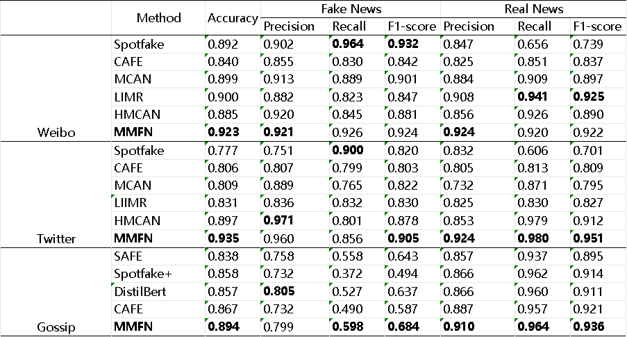
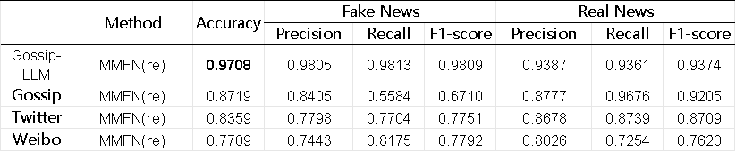
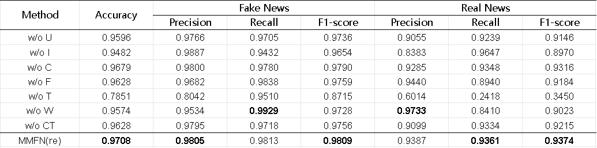

# 基于多粒度多模态信息融合的网络信息风险监测与治理系统

网络舆情数据/网络舆情监测任务具有**模态异质、语义稀疏、真伪交织**的特点，现有基于多模态特征融合的舆情监测方法，采用**全局特征拼接与晚期融合**机制，但是难以应对实际数据/任务的**细粒度语义对齐与跨模态干扰**特性。本项目创新性地提出基于**多粒度多模态特征融合**的舆情监测方法，结合**跨模态注意力与细粒度交互**的优势，提取**局部-全局协同的跨模态语义特征**，并基于此预测新闻与**多源证据**的适配性（真实性），解决了**模态间信息不对齐与细粒度证据利用不足**的问题。项目所提算法有效应用于（微博平台虚假新闻检测任务），取得了一定改进，具有良好的应用前景。

Enviroment requirements are as follows:

| enviroment | version |
| ---------- | ------- |
| PyTorch    | 1.13.1  |
| CUDA       | 12.2    |
| Python     | 3.9.19  |

## About

The dataset includes three datasets: **weibo, twitter, gossipcop, and gossipcop-LLM**. According to the original author's intention, only the dataset link of **gossipcop-LLM** is given here:
[https://github.com/junyachen/Data-examples](https://github.com/junyachen/Data-examples)

Other datasets can be obtained by contacting the original author.

The py file with the suffix of preprocess indicates the preprocessing of the dataset, and the py file with the suffix of dataset indicates the dataset class.

**train.py** is the training code. Running this code can get the reproducible results. Modifying the **forward** function in **class MMFN** can get different ablation experiment results.

## Result

The overall expriments as follows:

My reproduce expriments as follows:

The abalation expriments as follows:

